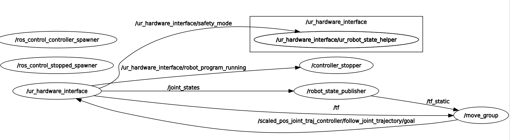
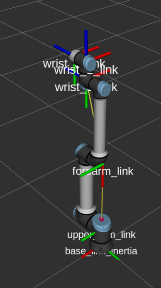

# DENSE_GRASP

[](https://opensource.org/licenses/Apache-2.0)
[](https://opensource.org/licenses/BSD-3-Clause)


## 1. PC Setup
```
https://github.com/UniversalRobots/Universal_Robots_ROS_Driver

git clone -b calibration_devel https://github.com/fmauch/universal_robot.git

sudo apt install ros-melodic-industrial-core
```
## 2. UR Robot setup
- Go to folder ```ur_robot_driver/resources/```
- Install "external_control_1.04.urcap"
- Version UR Techpendant controller: 5.9.1 Polyscope
- Setting the IP for UR Robot: ```192.168.1.101``` DNS: ```255.255.255.0``` , and port ```50002```

## 3. Running command
### 3.1 Starting robot
* **Remember reduce speed when running the robot ~30%**
```
Program --> URCap --> External Control 
Robot Program 
        |--> Control by <Your_PC_IP>
```
Pressing the Play to connect the robot to ROS-PC
### 3.2 ROS PC
__Bringup the robot control driver__

 Don't forget to source the correct setup shell files and use a new terminal for each command! 
```
roslaunch ur_robot_driver ur10e_bringup.launch robot_ip:=<Your_Robot_IP> 
```
Ex: ```roslaunch ur_robot_driver ur10e_bringup.launch robot_ip:=192.168.1.101 ```

 When you got the command ```Robot connected to reverse interface. Ready to receive control commands. ```. That mean your robot is already connected with your ROS-PC. Congratuation! 


__Running the moveit interface__
```
roslaunch ur10e_moveit_config ur10e_moveit_planning_execution.launch limited:=true
```
When you got the command ``` You can start planning now! ```. That the planning algorithms has been started.

- Nextstep running the Moveit! config with RViz view
```
roslaunch dense_grasp ur10_rviz.launch
```
__Usage with Gazebo Simulation__  
There are launch files available to bringup a simulated robot - either UR5e or UR10e.  In the following the commands for the UR10e are given. For the UR5, simply replace the prefix accordingly.  

To bring up the simulated robot in Gazebo, run:

```roslaunch ur_gazebo ur10e_bringup.launch```


___MoveIt! with a simulated robot___  
Again, you can use MoveIt! to control the simulated robot.  

For setting up the MoveIt! nodes to allow motion planning run:

```roslaunch ur10e_moveit_config ur10e_moveit_planning_execution.launch sim:=true```

For starting up RViz with a configuration including the MoveIt! Motion Planning plugin run:

```roslaunch dense_grasp ur10_rviz.launch ```

__UR robots node graph show__  
The *move_group* node is connecting to the *ur_hardware_interface* via the subscribed tf topic */tf*, that is help ROS-PC can get the current position of the robot when it power on mode. The topic */scaled_pos_joint_traj_controller/follow_joint_trajectory/goal* is sent to node *ur_hardware_interface* by node *move_group*, that is help the robot running by following trajectories is generated by **Moveit!**.
<center></center>

### 3.3 Control the robotics arm
__Test Forward Kinematic with Position Joint Trajectories Control__

Running the code below. The robot will running by each position of joint in amount of time.

```rosrun dense_grasp pos_joint_traj.py```

__Test inverse kinematic robotics arm__
```
 roslaunch dense_grasp ur10e_workspace.launch
 roslaunch ur10e_moveit_config ur10e_moveit_planning_execution.launch sim:=true
 roslaunch dense_grasp ur10_rviz.launch
 rosrun dense_grasp move_group_tutorial
 rosrun dense_grasp move_group_tutorial_py.py
 ```


## Troubleshooting
```rostopic list```
```
...
/scaled_pos_joint_traj_controller/command
/scaled_pos_joint_traj_controller/follow_joint_trajectory/cancel
/scaled_pos_joint_traj_controller/follow_joint_trajectory/feedback
/scaled_pos_joint_traj_controller/follow_joint_trajectory/goal
/scaled_pos_joint_traj_controller/follow_joint_trajectory/result
/scaled_pos_joint_traj_controller/follow_joint_trajectory/status
/scaled_pos_joint_traj_controller/state
/speed_scaling_factor
....

```
Up Position of UR
<center></center>

```
## joint name
joint_names: [elbow_joint, shoulder_lift_joint, shoulder_pan_joint, wrist_1_joint, wrist_2_joint, wrist_3_joint]
## home position of each joints
positions: [0, -pi/2, 0, -p/2, 0, 0]

```

