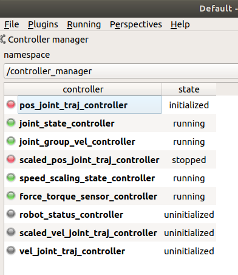

## Installation
Download the Leap_Motion_SDK_Linux_2.3.1.tgz in the link:

https://developer.leapmotion.com/tracking-software-download

Extract this file and Install deb file
Leap-2.3.1+31549-x64.deb

1. First, attempt the basic troubleshooting steps just like on Windows or Mac OS X. Run:

```sudo service leapd status ```

2. There could be any number of problems remaining. To execute leapd directly and see the output, run:
```
sudo service leapd stop
sudo leapd
```
The Terminal shows info ```WebSocket server started``` that mean Leap Motion has already connected :
```
[Info] WebSocket server started
[Info] Secure WebSocket server started
[Info] Leap Motion Controller detected: S330A001123
[Info] Firmware is up to date.
```

3. Open another Terminal and Running LeapControlPanel
```
LeapControlPanel --showsettings
Visualizer
Recalibrate
```
4. Install ROS Leap Motion
```
https://github.com/ros-drivers/leap_motion
```

5. Running the leap motion demo

```roslaunch leap_motion demo.launch```

# ROS Moveit Servo
(https://github.com/ros-planning/moveit/tree/master/moveit_ros/moveit_servo)
## Simulation robot
1. Running the Robot simulation
   
``` roslaunch dense_grasp ur10e_workspace.launch```

2.  Robot Requirements

The servo node streams an array of position or velocity commands to the robot controller. This is compatible with ros_control ```position_controllers/JointGroupPositionControllers``` or ```velocity_controllers/JointGroupVelocityControllers```. You can check if these controllers are available for your robot by searching for the controller config file (typically named controllers.yaml). After launching the robot, you can check if any ros_control controllers are available with:

```
rosservice call /controller_manager/list_controllers
```
 *Method 1* : Running the realtime teleop turn on the `joint_group_pos_controller`, this using for `servo_serve` node and turn off `pos_joint_traj_controller`, this using for moveit control the robotic arm. Using command.
```
rosservice call /controller_manager/switch_controller "start_controllers: ['joint_group_pos_controller']
stop_controllers: ['pos_joint_traj_controller']
strictness: 0
start_asap: false
timeout: 0.0"
``` 
 *Method2* : Using `rqt/controller_manager` to switch choose the controller. 

3. Runnning Node Servo_Server with 3D mouse
```
roslaunch dense_grasp space_nav.launch 
```
4. Send the fake signal of 3D Mouse
```
rostopic pub -r 100 -s /servo_server/delta_twist_cmds geometry_msgs/TwistStamped "header: auto
twist:
  linear:
    x: 0.0
    y: 0.0
    z: 0.01
  angular:
    x: 0.0
    y: 0.0
    z: 0.0"
```

## Real Robot robot
1. Running the Real robot.
  
```roslaunch ur_robot_driver ur10e_bringup.launch robot_ip:=192.168.1.101 ```

 When you got the command ```Robot connected to reverse interface. Ready to receive control commands. ```. That mean your robot is already connected with your ROS-PC. Congratuation! 
 
__Change cotroller to **joint_group_vel_controller**__
<center></center>

Deactivate **scale_pos_joint_traj_controller** and activate **joint_group_vel_controlle** by right click, or using code below.

```
rosservice call /controller_manager/switch_controller "start_controllers: ['joint_group_vel_controller']
stop_controllers: ['scale_pos_joint_traj_controller']
strictness: 0
start_asap: false
timeout: 0.0"
``` 
__Running the moveit interface__
```
roslaunch ur10e_moveit_config ur10e_moveit_planning_execution.launch limited:=true
```
When you got the command ``` You can start planning now! ```. That the planning algorithms has been started.

- 2. Nextstep running the Moveit! config with RViz view
```
roslaunch dense_grasp ur10_rviz.launch

```
- 3. Runnning Node Servo_Server with 3D mouse
```
roslaunch dense_grasp space_nav_real.launch 
```

- 4. Send the fake signal of 3D Mouse
```
rostopic pub -r 200 -s /servo_server/delta_twist_cmds geometry_msgs/TwistStamped "header: auto
twist:
  linear:
    x: 0.0
    y: 0.0
    z: -0.01
  angular:
    x: 0.0
    y: 0.0
    z: 0.0"
```
---> Robot start moving a litle bit

5. Changing Control Dimensions

The dimensions being controlled may be changed with the change_control_dimensions (```moveit_msgs/ChangeControlDimensions```) service. The service consists of the 6 booleans representing the manipulator’s degrees of freedom (3 translation and 3 rotation), defined in the input velocity command frame. Setting one of these booleans to false will result in the user input in that direction being overwritten with a 0, thus disallowing motion in the direction.
```
rosservice call /servo_server/change_control_dimensions "{control_x_translation: true, control_y_translation: true, control_z_translation: true,
  control_x_rotation: true, control_y_rotation: true, control_z_rotation: true}" 

```